# MultiShop Mikroservis Projesi – .NET Core 6.0

## Genel Tanıtım
MultiShop, modern mikroservis mimarisi ile geliştirilmiş, esnek ve ölçeklenebilir bir e-ticaret platformudur. Docker entegrasyonu sayesinde kolay taşınabilirlik ve güvenli dağıtım sağlanmıştır. Sistem, MSSQL, PostgreSQL, MongoDB ve Redis gibi farklı veritabanlarıyla uyumlu çalışacak şekilde yapılandırılmıştır.

## 🔧 Proje Özellikleri

### 🔨 Mikroservis Mimarisi
Servislerin bağımsız çalışabilmesi için Katmanlı ve Soğan Mimarisi yaklaşımı benimsenmiş, SOLID prensipleri doğrultusunda ölçeklenebilir bir yapı kurulmuştur.

### 🎯 Tasarım Desenleri
Kodun sürdürülebilirliğini ve yeniden kullanılabilirliğini sağlamak adına Repository, CQRS ve Mediator desenleri etkin bir şekilde uygulanmıştır.

### 🔐 Güvenlik
Kullanıcı kimlik doğrulama ve yetkilendirme süreçlerinde Identity Server ve JWT (JSON Web Token) kullanılarak güvenli bir yapı oluşturulmuştur.

### 💾 Veritabanı Entegrasyonu
Projede MSSQL, MongoDB, PostgreSQL ve Redis veritabanları kullanılarak kapsamlı veri yönetimi sağlanmıştır.

### 🌐 API Gateway
Servisler arası iletişim ve yönlendirme işlemleri için Ocelot API Gateway tercih edilmiş; API'lerin belgelenmesi için Swagger desteği entegre edilmiştir.

### 📡 Gerçek Zamanlı Özellikler
Uygulama içinde anlık güncellemeler ve bildirimler, sayfa yenilemeden gerçekleşmesi için SignalR ile gerçekleştirilmiştir.

### ✅ Test ve Doğrulama
Geliştirilen API uç noktaları, Postman üzerinden detaylı şekilde test edilmiş ve doğrulanmıştır.

## ⚙️ Kullanılan Teknolojiler

- **Backend**: ASP.NET Core 6.0 Web API
- **Veritabanları**: MSSQL, PostgreSQL, MongoDB, Redis
- **Containerization**: Docker ile mikroservislerin konteyner tabanlı dağıtımı
- **Veritabanı Araçları**: Dapper & DBeaver ile hızlı ve etkin veri yönetimi
- **API Testi ve Dökümantasyon**: Swagger & Postman
- **Mesajlaşma**: RabbitMQ ile asenkron mesaj kuyruğu yönetimi
- **Bulut Depolama**: Google Cloud Storage ile esnek veri saklama
- **Mimari Desenler**: Soğan Mimarisi, CQRS, Mediator, Repository Pattern
- **Güvenlik**: Identity Server & JWT
- **API Yönlendirme**: Ocelot Gateway
- **Gerçek Zamanlı İletişim**: SignalR
- **Frontend**: HTML, CSS, JavaScript, Bootstrap

## 📸 Proje Görselleri

### Ana Sayfa
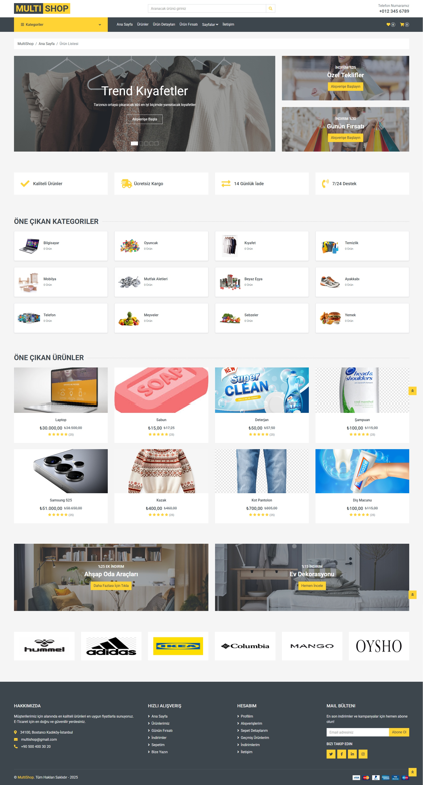

### Docker
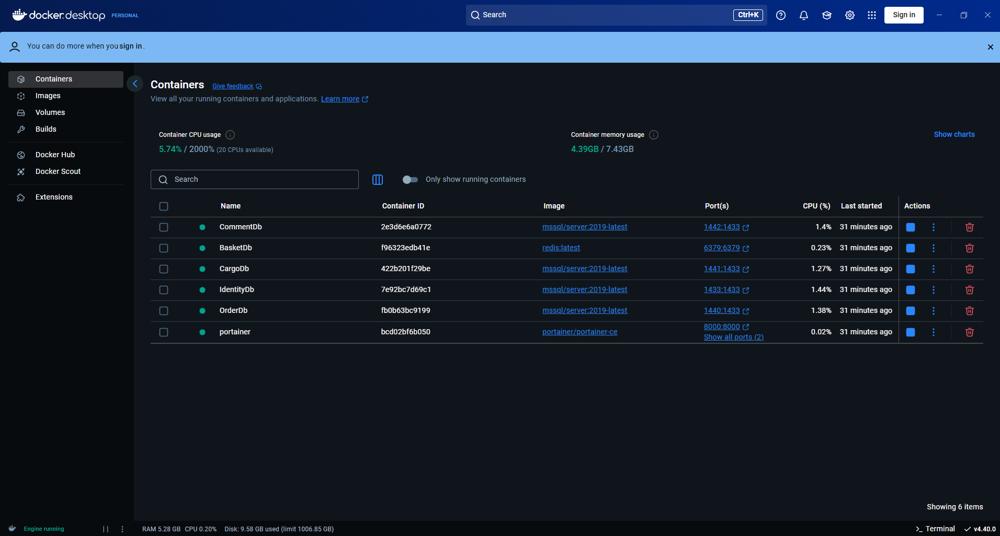

### Giriş Sayfası
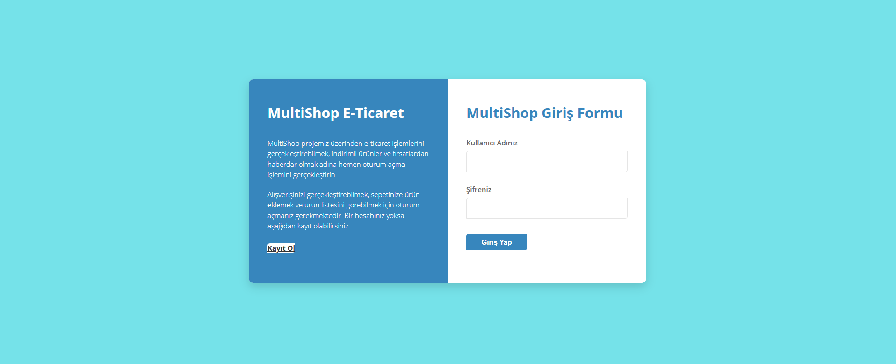

### İletişim Sayfası
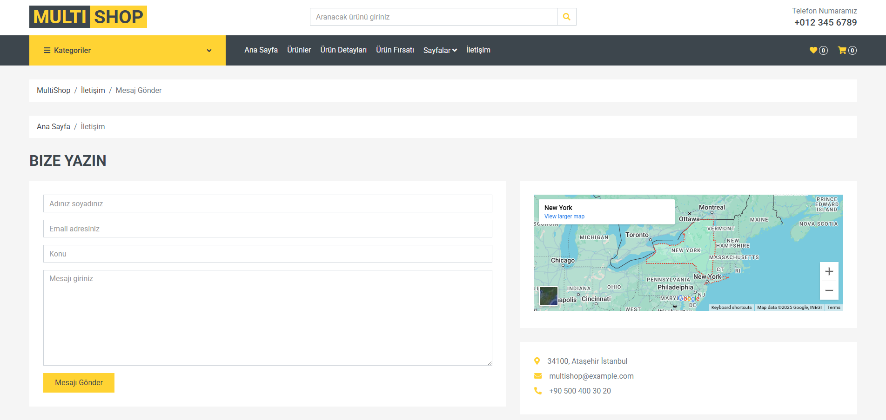

### İstatistikler
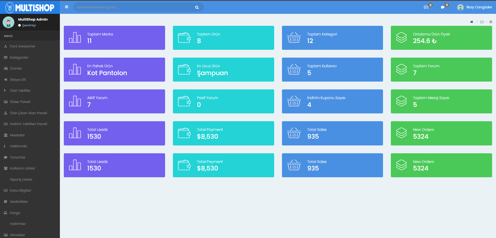

### Kayıt Sayfası
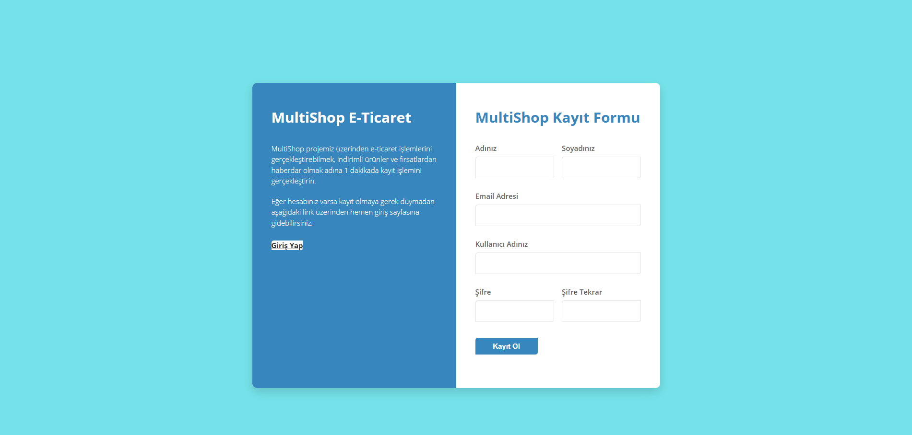

### Markalar
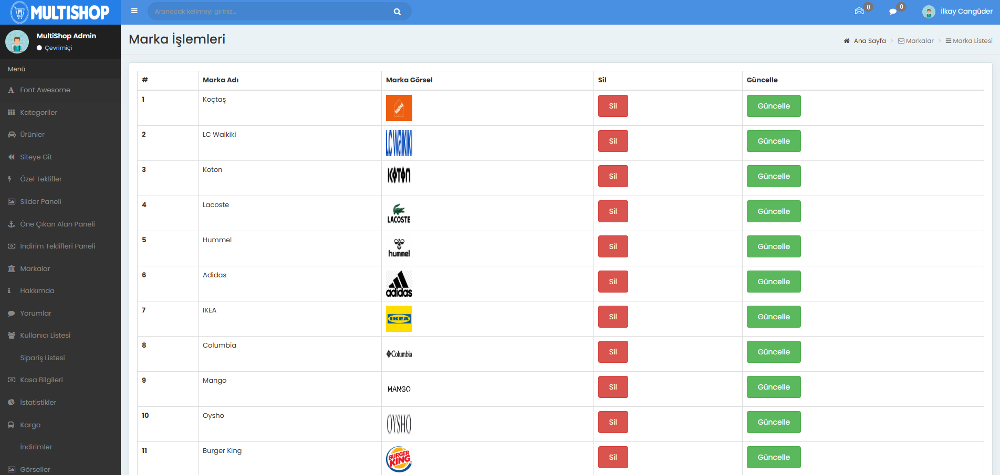

### MongoDB
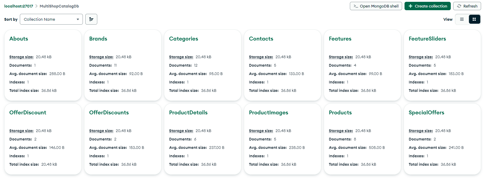

### Ürün Detay
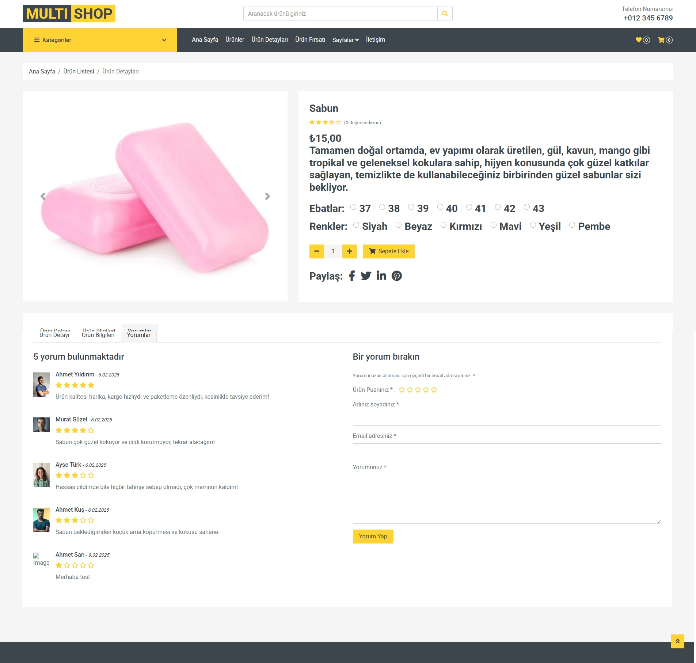

### Sepet
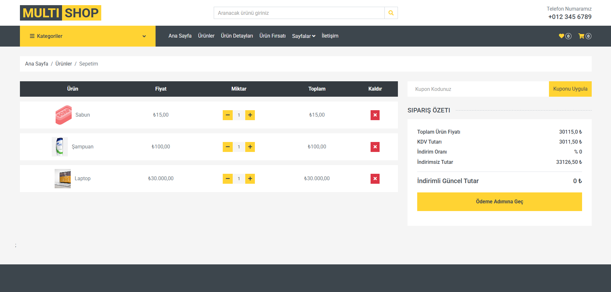

### Ürün Listesi
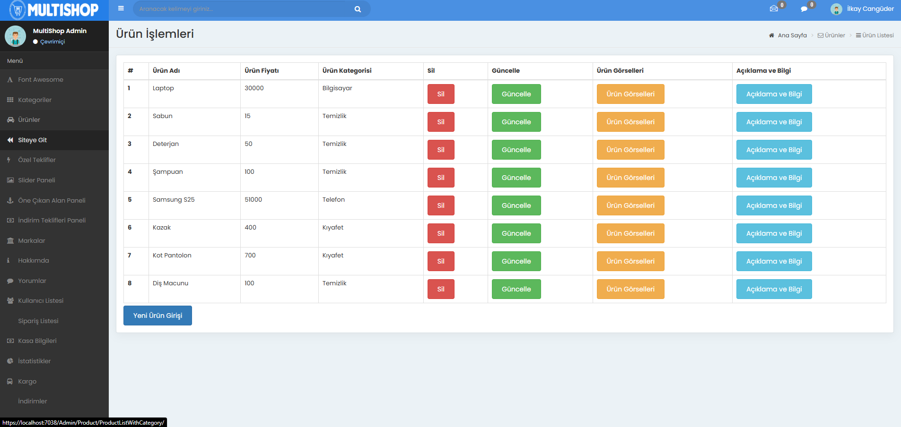

### Yorumlar
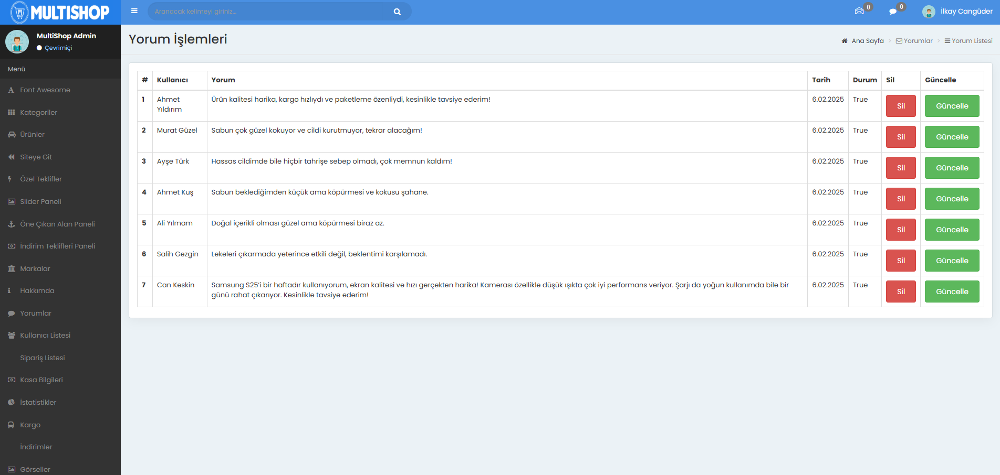
